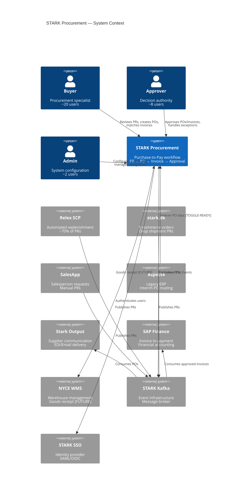
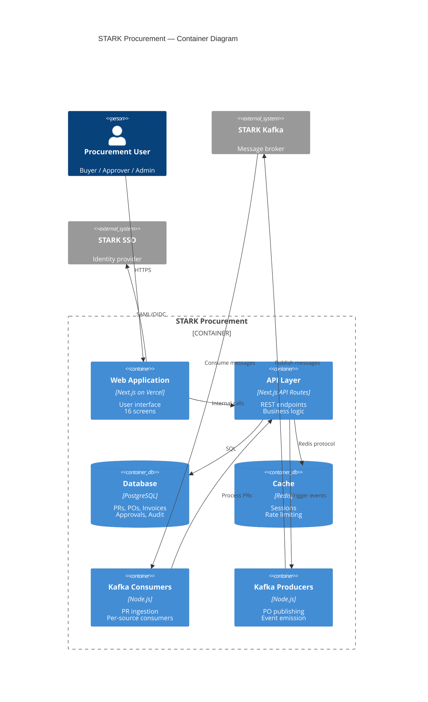
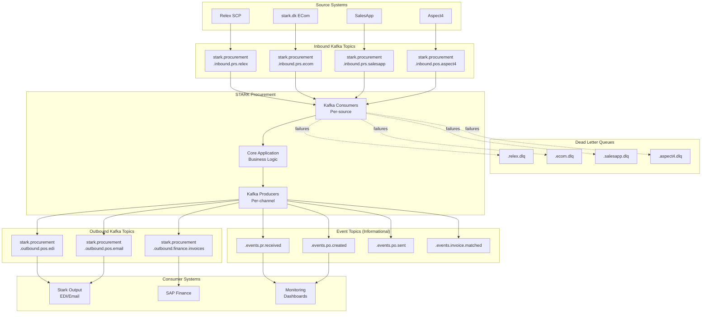
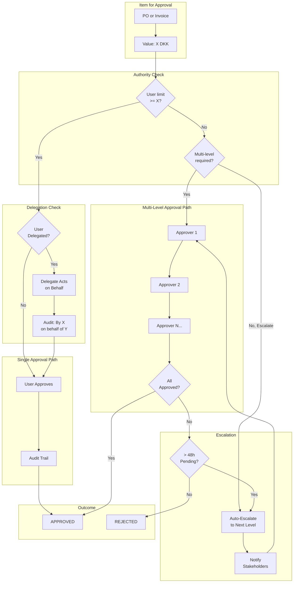
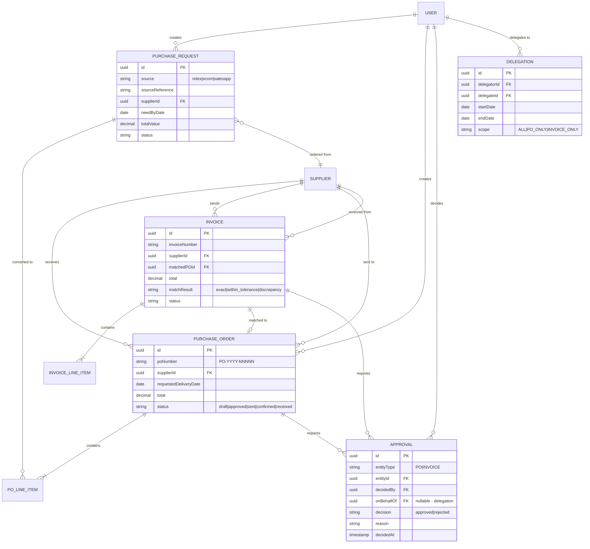
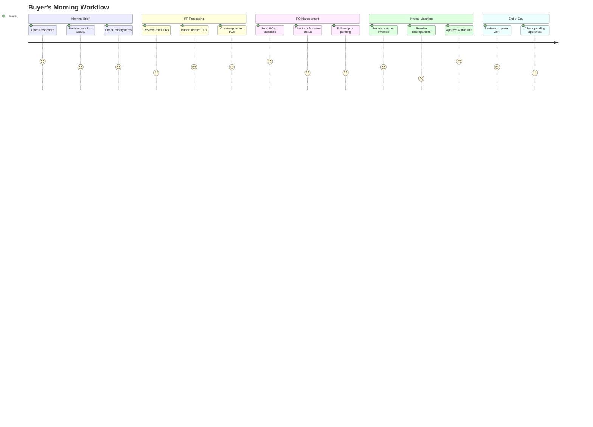
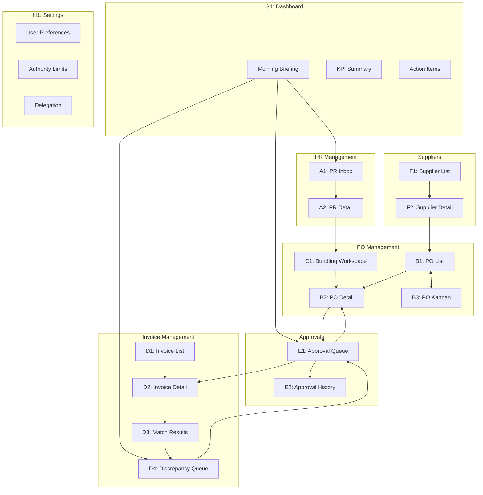

# STARK Procurement — Architecture Diagrams

> **Purpose:** Visual architecture documentation for enterprise stakeholders
> **Framework:** TOGAF-aligned using ai-assisted-architecture standards
> **Last Updated:** 2026-03-23

---

## 1. System Context (C4 Level 1)

Shows STARK Procurement and its interactions with external systems and users.

---

## 2. Container Diagram (C4 Level 2)

Shows the internal containers of STARK Procurement.

---

## 3. Kafka Integration Architecture

Shows the topic topology for Kafka-native integration.

---

## 4. Process Flow: PR to Payment

Shows the end-to-end procurement workflow.

```mermaid
flowchart LR
    subgraph Ingestion["1. PR Ingestion"]
        pr_receive[Receive PR<br/>via Kafka]
        pr_validate[Validate<br/>& Deduplicate]
        pr_classify[Classify by<br/>Source & Value]
    end

    subgraph POGen["2. PO Generation"]
        bundle[Bundling<br/>Workspace]
        po_create[Create PO<br/>with Packets]
        po_price[Apply<br/>Pricing]
    end

    subgraph Approval1["3. PO Approval"]
        po_route[Route by<br/>Value & Authority]
        po_approve{Within<br/>Limit?}
        po_chain[Multi-Level<br/>Chain]
    end

    subgraph Send["4. Supplier Communication"]
        po_format[Format for<br/>Channel]
        po_send[Send via<br/>Stark Output]
        po_confirm[Await<br/>Confirmation]
    end

    subgraph Invoice["5. Invoice Processing"]
        inv_receive[Receive<br/>Invoice]
        inv_match[2-Way<br/>Match]
        inv_discrepancy{Match<br/>OK?}
    end

    subgraph Approval2["6. Invoice Approval"]
        inv_route[Route by<br/>Value]
        inv_approve[Approve for<br/>Payment]
        inv_export[Export to<br/>SAP Finance]
    end

    pr_receive --> pr_validate --> pr_classify
    pr_classify --> bundle --> po_create --> po_price
    po_price --> po_route --> po_approve
    po_approve -->|Yes| po_format
    po_approve -->|No| po_chain --> po_format
    po_format --> po_send --> po_confirm
    po_confirm --> inv_receive --> inv_match --> inv_discrepancy
    inv_discrepancy -->|Yes| inv_route
    inv_discrepancy -->|No| bundle
    inv_route --> inv_approve --> inv_export
```

---

## 5. Approval Workflow

Shows the approval decision flow with authority matrix and escalation.

---

## 6. Data Model Overview

Shows the key entities and their relationships.

---

## 7. User Journey: Buyer's Morning

Shows a typical Buyer workflow using the system.

---

## 8. Screen Navigation Map

Shows how users navigate between screens.

---

## Appendix: Diagram Legend

### C4 Model Colors

| Element | Color | Description |
|---------|-------|-------------|
| Person | Blue | Human actors |
| System (Internal) | Navy | STARK Procurement |
| System (External) | Gray | External systems |
| Container | Light Blue | Deployable units |
| Database | Blue-Gray | Data stores |

### Flow Diagram Colors

| Element | Color | Description |
|---------|-------|-------------|
| Process | Blue | Active processing |
| Decision | Yellow | Decision point |
| Data Store | Green | Storage |
| External | Gray | External system |
| DLQ/Error | Orange | Error handling |

### Status Indicators

| Status | Color | Description |
|--------|-------|-------------|
| Success | Green | Completed successfully |
| Attention | Orange | Needs review |
| Urgent | Red | Immediate action |
| Pending | Gray | Awaiting action |

---

*These diagrams follow TOGAF and C4 model standards. Source: `.ai-assisted-architecture/` framework.*
